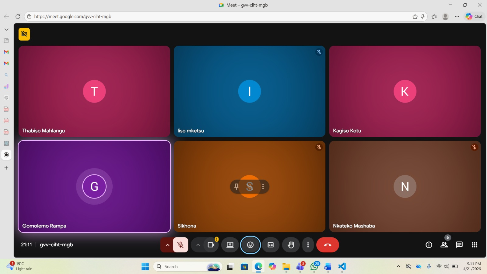

# Scrum 1

# Objectives

1. Discuss Sprint 2 feedback and recommendations
2. Plan new approach for upcoming sprint
3. Allocate tasks and identify project improvements

---

## Meet up with Client

The meeting took place on 21 April 2026 with all team members present. The meeting occurred after the Sprint 2 marking session with the tutor (client). The team discussed the feedback and recommendations received during the marking process, particularly areas where the project needed significant improvement.

**Sprint Duration Update:**

It was noted that the sprint duration had been extended from 2 weeks to 3 weeks, giving the team additional time to improve the system and address previous shortcomings.

---

## Choose Specifications

**Discussion Points:**

| Topic | Details |
|-------|---------|
| Feedback Review | Concerns were raised regarding the overall quality and progress of the sprint submission. The team acknowledged that improvements were necessary moving forward |
| New Approach | The team discussed a new approach for the upcoming sprint to ensure better progress, improved collaboration, and higher quality work |
| Task Management | Better task management and accountability |
| Unfinished Features | Focusing on unfinished or poorly implemented features |
| UI/UX Improvements | Improving the system's user interface and functionality |
| Consistent Contribution | Ensuring members contribute consistently throughout the sprint |
| Task Prioritization | Planning and prioritizing tasks that needed immediate attention before development could continue smoothly |

**Outcome:**

| Agreement | Description |
|-----------|-------------|
| Organized Approach | The team agreed to take a more organized and collaborative approach for the new sprint |
| Additional Week | The additional sprint week would be used to improve the quality of the system and address tutor feedback |
| Outstanding Tasks | Team members agreed to focus on completing outstanding tasks and improving overall project progress |

---

## Create Backlog

**Items added to backlog for Sprint 3:**

- Address Sprint 2 feedback and recommendations
- Improve overall system quality and progress
- Complete unfinished or poorly implemented features
- Enhance user interface and functionality
- Implement better task management and accountability
- Ensure consistent team member contributions
- Prioritize immediate attention tasks

## Evidence

