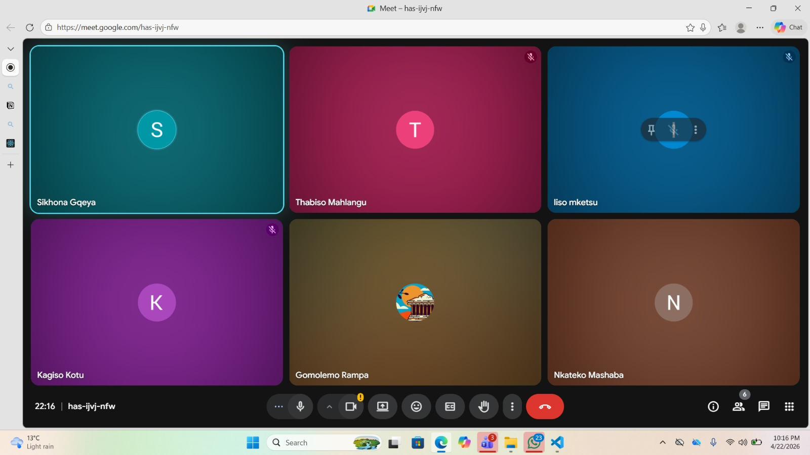

# Scrum 2

# Objectives

1. Review current system issues and pending tasks
2. Discuss accountability and workflow management
3. Discuss dashboard improvements for Sprint 2 feedback

---

## Meet up with Client

The meeting took place on 22 April 2026 with all team members present. The client was not present at this internal meeting. The team reviewed the current system issues and pending tasks based on feedback received from the tutor during Sprint 2 marking.

**Shared Task Management:**

A shared Notion page was created for all group members. The page contains a list of items and issues that currently need to be fixed within the system. Each group member was assigned the responsibility of selecting at least one task from the list on a daily basis and attempting to complete it before the daily scrum meeting. Members were instructed to cross out completed tasks to help track progress.

---

## Choose Specifications

**Purpose of Shared Task List:**

| Objective | Description |
|-----------|-------------|
| Accountability | Improve accountability among team members |
| Continuous Progress | Ensure continuous progress on the system |
| Visibility | Provide visibility on completed and pending work |

**Task List Review:**

The task list was reviewed together with all group members to ensure everyone clearly understood:
- What needed to be done
- The priorities of the tasks
- Any additions or removals required on the list

Team members were given an opportunity to suggest changes, including adding or removing items from the list where necessary.

**Dashboard Improvements Discussion:**

The team discussed ideas and improvements for the new dashboards based on recommendations provided by the tutor during Sprint 2 feedback. Different layout and functionality suggestions were considered to improve:
- Usability
- Appearance
- Overall user experience of the dashboards

---

## Create Backlog

**Items added to backlog:**

- Create and maintain shared Notion page for task tracking
- Assign daily task selection before daily scrum
- Cross out completed tasks to track progress
- Review and prioritize pending system issues
- Add or remove tasks from list as needed
- Implement dashboard layout improvements
- Enhance dashboard usability and appearance
- Improve overall user experience based on tutor feedback

## Evidence

