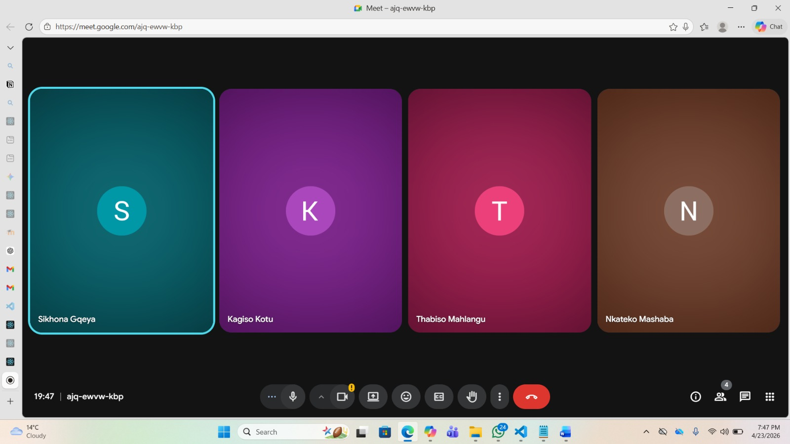

# Scrum 3

# Objectives

1. Review progress on tasks from shared Notion page
2. Discuss accountability and daily scrum meetings
3. Present and review the new admin dashboard

---

## Meet up with Client

The meeting took place on 23 April 2026 with all team members present. The client was not present at this internal meeting. A new admin dashboard design was presented to the group. The dashboard layout, structure, and functionality were demonstrated to all team members for feedback and discussion.

**Daily Scrum Meetings:**

The team agreed that daily scrum meetings would officially begin on 24 April 2026 to help improve communication, track progress, and ensure tasks were being completed consistently.

---

## Choose Specifications

**Progress Review:**

| Issue | Details |
|-------|---------|
| Task Completion | It was noted that most team members had not selected or completed tasks from the shared Notion task list as previously discussed |
| Reminder | Team members were reminded again about the importance of choosing tasks from the list, completing them, and updating the list accordingly to ensure accountability and visible progress within the project |

**Dashboard Feedback and Suggestions:**

Team members provided suggestions regarding:

| Area | Focus |
|------|-------|
| User Interface | UI and layout improvements |
| Navigation | Navigation and usability |
| Component Placement | Placement of dashboard components and information |
| Features | Features and functionality that could improve overall user experience |

**Challenges Discussed:**

Team members also discussed some of the issues and challenges they were experiencing while working on different parts of the system.

---

## Create Backlog

**Items added to backlog:**

- Actively select and complete tasks from shared Notion page
- Update task list upon completion
- Begin daily scrum meetings starting 24 April 2026
- Implement feedback and recommended changes for admin dashboard
- Refine dashboard layout and functionality
- Address issues and challenges faced during development
- Improve collaboration within the project

## Evidence

