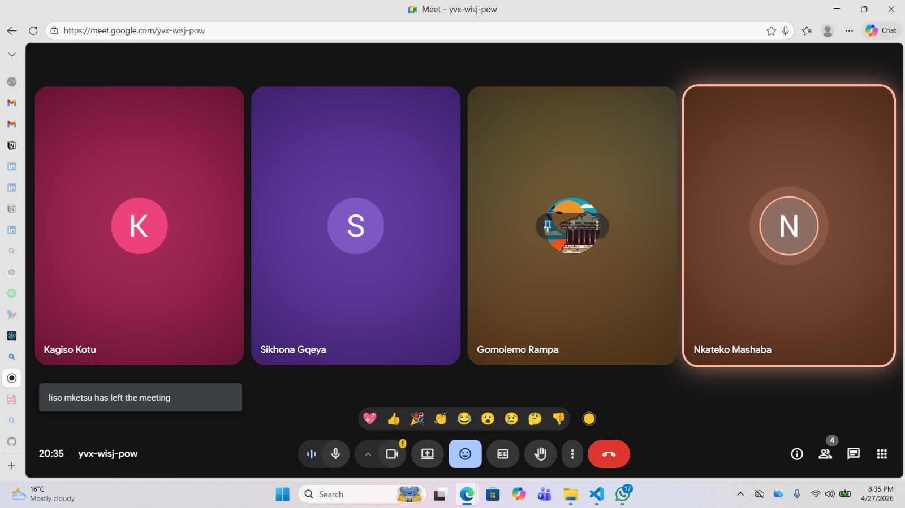

# Scrum 4

# Objectives

1. Present the new admin dashboard
2. Discuss dashboard improvements and recommendations
3. Address team member development issues and challenges

---

## Meet up with Client

The meeting took place on 27 April 2026 with all team members present. The client was not present at this internal meeting. A new admin dashboard design was presented to the group. The dashboard layout, structure, and functionality were demonstrated to all team members for feedback and discussion.

---

## Choose Specifications

**Dashboard Review and Feedback:**

Most of the meeting focused on reviewing the dashboard and discussing recommended changes and improvements. Team members provided suggestions regarding:

| Area | Focus |
|------|-------|
| User Interface | UI and layout improvements |
| Navigation | Navigation and usability |
| Component Placement | Placement of dashboard components and information |
| Features | Features and functionality that could improve user experience |

**Development Challenges:**

Team members discussed various issues and challenges they were experiencing while working on different parts of the system. Possible solutions and approaches were discussed collaboratively to assist members in resolving their issues and continuing with development.

---

## Create Backlog

**Items added to backlog:**

- Implement feedback and recommended changes for admin dashboard
- Refine dashboard layout and functionality
- Address development challenges collaboratively
- Resolve issues blocking development progress
- Continue improving user experience based on feedback

## Evidence

