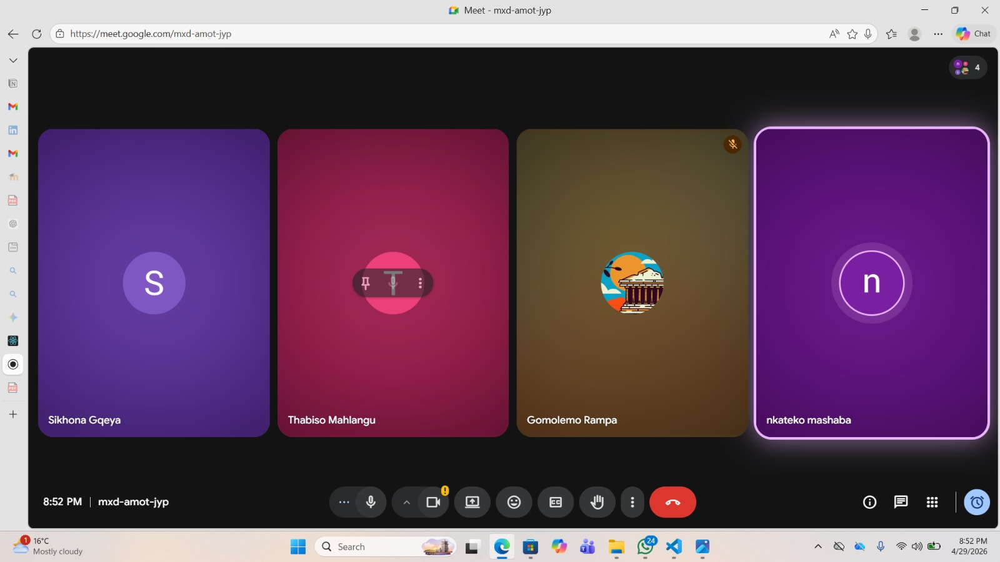

# Scrum 5

# Objectives

1. Discuss Sprint 3 user stories
2. Allocate user stories to team members
3. Plan sprint and distribute workload

---

## Meet up with Client

The meeting took place on 29 April 2026 with 4 team members present (one member absent). The client was not present at this internal meeting. The team discussed the user stories that needed to be implemented for Sprint 3.

**Priority Strategy:**

It was agreed that priority should be given to user stories that were more difficult, complex, or time-consuming since the team had 3 weeks before the sprint deadline. The aim was to ensure that challenging tasks were started early enough to avoid rushing near the submission date.

---

## Choose Specifications

**User Story Allocation:**

| Allocation | Details |
|------------|---------|
| Present Members | Each of the 4 members present selected a user story to work on |
| Absent Members | The remaining user stories would later be shared with the team members who were absent so they could also choose tasks to work on |

**Sprint Planning Focus:**

- Prioritize difficult, complex, and time-consuming user stories
- Start challenging tasks early to avoid last-minute rushing
- Ensure balanced workload distribution across all team members

---

## Create Backlog

**Items added to backlog for Sprint 3:**

- Review and prioritize Sprint 3 user stories
- Assign user stories to present members (4 members)
- Reserve remaining user stories for absent members
- Begin implementation of challenging user stories as early as possible
- Share remaining tasks with absent team members

## Evidence

