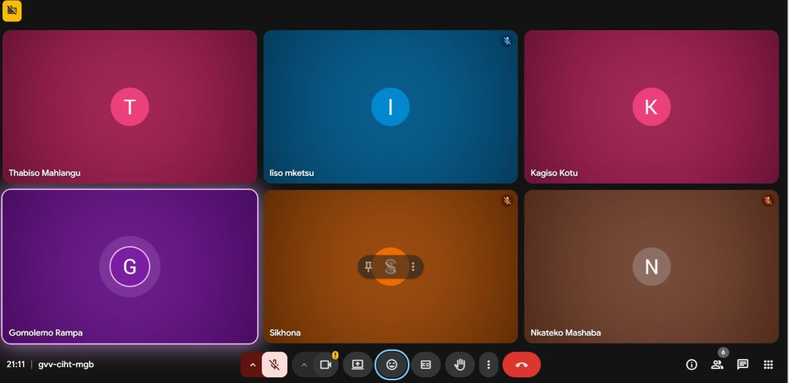

# Scrum 1

# Objectives

1. Discuss and select Sprint 4 user stories
2. Justify inclusion of each user story
3. Prioritize stories for the sprint

---

## Meet up with Client

The team convened to discuss Sprint 4 user stories. All team members were present. The client was not present at this internal meeting. The team reviewed feedback from Sprint 3 and identified areas that needed further enhancement before selecting new user stories for Sprint 4.

**Sprint 4 Context:**

The team agreed that Sprint 4 would focus on adding value by introducing features that improve financial tracking, contribution management, payout processing, and data analytics based on previous feedback from both the client and team retrospectives.

---

## Choose Specifications

**User Stories Proposed for Sprint 4:**

The team discussed the following user stories and justified why each should be included:

| # | Role | User Story | Justification |
|---|------|------------|----------------|
| 1 | Member | As a Member, I want to view contribution compliance reports over time so that I can monitor my contribution consistency and payment history | Essential for member self-awareness and financial accountability |
| 2 | Member | As a Member, I want to view payout history and upcoming payout projections so that I can track previous payouts and prepare for future ones | Improves financial planning and transparency for members |
| 3 | Member | As a Member, I want a customizable analytics dashboard with filtering and export options (CSV/PDF) so that I can personalize, analyze, and keep records of my financial information | Provides advanced data analysis and record-keeping capabilities |
| 4 | Treasurer | As a Treasurer, I want to initiate payout disbursements so that member payouts can be processed and recorded digitally | Digitizes payout process and creates digital records |
| 5 | Treasurer | As a Treasurer, I want to confirm/flag missed payments so that I can accurately track who has paid and ensure outstanding payments are identified and followed up on | Critical for accurate contribution tracking and follow-up |
| 6 | Member | As a Member, I want to receive payouts directly into my bank account so that I can access my funds conveniently and securely | Enhances user convenience and security for receiving funds |

**Selection Outcome:**

All 6 user stories were agreed upon by the team. The team noted that these stories collectively address:
- Financial transparency
- Member self-service
- Treasurer workflow efficiency
- Data export and analytics capabilities

---

## Create Backlog

**Items added to backlog for Sprint 4:**

- Contribution compliance reports (Member)
- Payout history and projections (Member)
- Customizable analytics dashboard with CSV/PDF export (Member)
- Payout disbursement initiation (Treasurer)
- Missed payment confirmation/flagging (Treasurer)
- Direct bank account payouts (Member)

## Evidence

