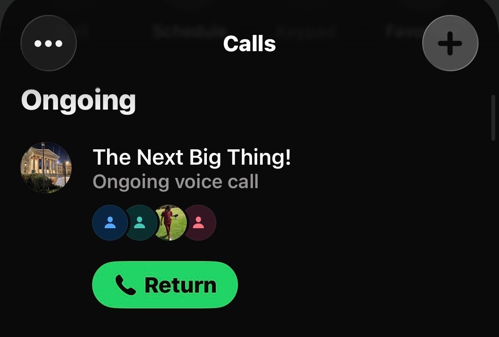

# Scrum 2

# Objectives

1. Allocate user stories to team members
2. Assign responsibilities for each task
3. Establish deadlines and expectations

---

## Meet up with Client

The meeting took place with all team members present. The client was not present at this internal meeting. Following the finalization of Sprint 4 user stories, the team proceeded to allocate each story to a specific team member to ensure clear ownership and accountability.

**Allocation Process:**

Each team member selected a user story to work on based on their expertise and availability. Members will be responsible for both frontend and backend implementation of their chosen user story where applicable.

---

## Choose Specifications

**Task Allocation:**

The following user stories were assigned to team members:

| # | User Story | Assigned To |
|---|------------|-------------|
| 1 | As a Member, I want to view contribution compliance reports over time so that I can monitor my contribution consistency and payment history | Kagiso |
| 2 | As a Member, I want to view payout history and upcoming payout projections so that I can track previous payouts and prepare for future ones | Nkateko |
| 3 | As a Member, I want a customizable analytics dashboard with filtering and export options (CSV/PDF) so that I can personalize, analyze, and keep records of my financial information | Gomolemo |
| 4 | As a Treasurer, I want to initiate payout disbursements so that member payouts can be processed and recorded digitally | Thabiso |
| 5 | As a Treasurer, I want to confirm/flag missed payments so that I can accurately track who has paid and ensure outstanding payments are identified and followed up on | Sikhona |
| 6 | As a Member, I want to receive payouts directly into my bank account so that I can access my funds conveniently and securely | Liso |

**Expectations & Deadlines:**

| Expectation | Description |
|-------------|-------------|
| Ownership | Each member is responsible for their assigned user story from implementation to testing |
| Integration | Members must ensure their feature integrates smoothly with existing system components |
| Deadline | All user stories must be completed by the end of Sprint 4 |

---

## Create Backlog

**Items added to backlog for Sprint 4:**

- Kagiso: Contribution compliance reports
- Nkateko: Payout history and projections
- Gomolemo: Customizable analytics dashboard with export
- Thabiso: Payout disbursement initiation
- Sikhona: Missed payment confirmation/flagging
- Liso: Direct bank account payouts

## Evidence

