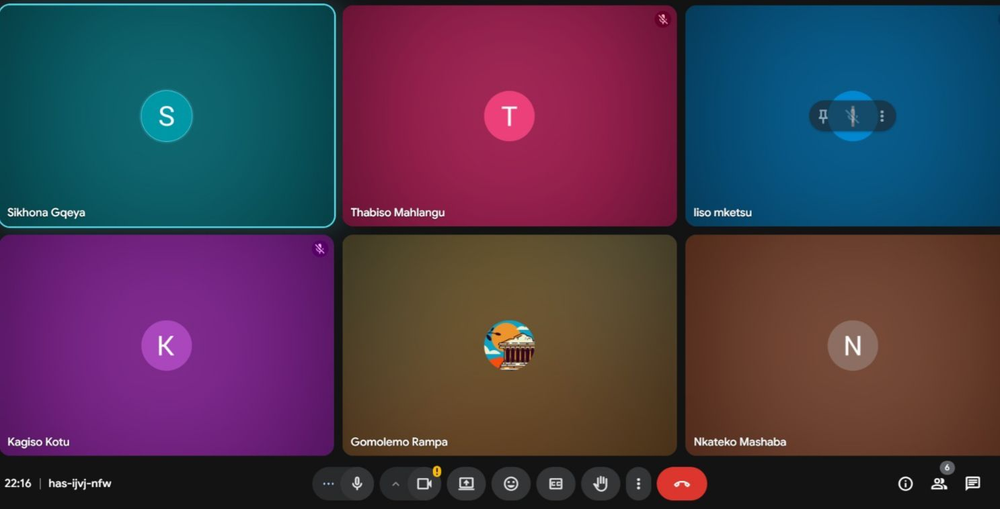

# Scrum 3

# Objectives

1. Review progress on assigned user stories
2. Address blockers and challenges
3. Ensure alignment across workstreams

---

## Meet up with Client

The team met for a progress check on their Sprint 4 tasks. All team members were present. The client was not present at this internal meeting. Each member shared their current progress on their assigned user stories.

**Progress Summary:**

| Team Member | User Story | Progress Status | Challenges |
|-------------|------------|----------------|------------|
| Kagiso | Contribution compliance reports | In progress – database queries being implemented | Ensuring accurate calculation of compliance percentages |
| Nkateko | Payout history and projections | In progress – frontend display being built | Projection algorithm needs refinement |
| Gomolemo | Analytics dashboard with export | Early stage – designing dashboard layout | CSV/PDF export library integration |
| Thabiso | Payout disbursement initiation | In progress – backend logic being developed | Payment gateway integration |
| Sikhona | Missed payment confirmation/flagging | Nearly complete – testing phase | None reported |
| Liso | Direct bank account payouts | In progress – user input form created | Bank account validation and security |

---

## Choose Specifications

**Challenges & Solutions Discussed:**

| Challenge | Proposed Solution |
|-----------|-------------------|
| Compliance percentage calculation | Use aggregate payment data against expected contributions |
| Projection algorithm refinement | Base on historical payout patterns and contribution trends |
| CSV/PDF export integration | Research and implement a suitable JavaScript library |
| Payment gateway integration | Explore available APIs for digital payout processing |
| Bank account validation | Implement regex patterns and potentially third-party validation |

**Agreements:**

- Team members will assist each other with library integration challenges
- Payment-related features will be prioritized for security review
- Daily stand-ups will continue to track progress

---

## Create Backlog

**Items added to backlog for Sprint 4:**

- Complete compliance report calculations (Kagiso)
- Finalize projection algorithm (Nkateko)
- Implement CSV/PDF export functionality (Gomolemo)
- Integrate payment gateway for payouts (Thabiso)
- Complete testing for missed payment flagging (Sikhona)
- Add bank account validation and security (Liso)

## Evidence

