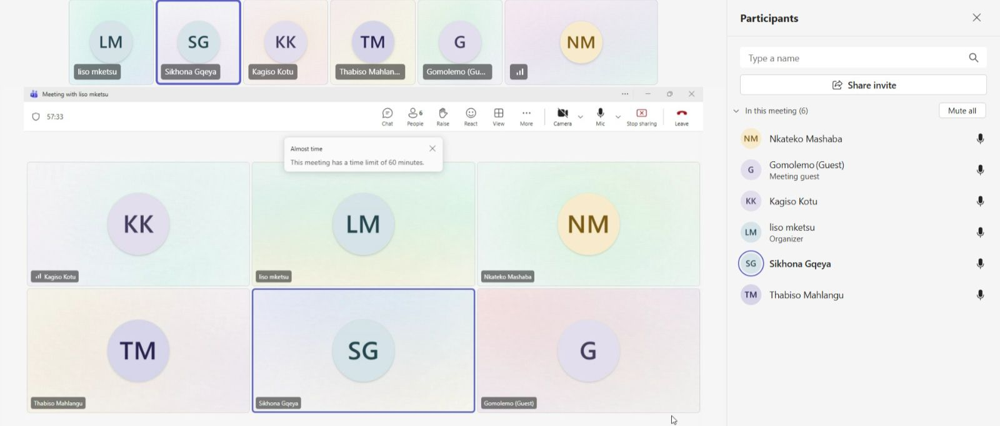

# Scrum 4

# Objectives

1. Review final progress before completion
2. Address any remaining blockers
3. Prepare for final presentation

---

## Meet up with Client

The team met for a second progress check on Sprint 4 tasks. All team members were present. The client was not present at this internal meeting. Members reported significant progress since the previous meeting.

**Progress Summary:**

| Team Member | User Story | Progress Status | Remaining Work |
|-------------|------------|----------------|----------------|
| Kagiso | Contribution compliance reports | 90% complete | UI polish and testing |
| Nkateko | Payout history and projections | 85% complete | Integration with backend data |
| Gomolemo | Analytics dashboard with export | 80% complete | PDF styling and formatting |
| Thabiso | Payout disbursement initiation | 85% complete | Error handling and logging |
| Sikhona | Missed payment confirmation/flagging | 100% complete | Ready for review |
| Liso | Direct bank account payouts | 80% complete | Security testing |

---

## Choose Specifications

**Key Discussion Points:**

| Topic | Details |
|-------|---------|
| Integration Testing | Team agreed to test how features interact with each other, especially payout and contribution tracking |
| UI Consistency | Gomolemo will share dashboard styling guidelines to ensure visual consistency across all new features |
| Security Review | Liso and Thabiso will conduct a joint security review of all payment-related features |
| Documentation | Each member must document their implementation for the final presentation |

**Blockers Resolved:**

- CSV/PDF export library successfully integrated (Gomolemo)
- Projection algorithm refined using historical data (Nkateko)
- Payment gateway API connected successfully (Thabiso)

**Remaining Blockers:**

- Bank account validation edge cases still being addressed (Liso)

---

## Create Backlog

**Items added to backlog for Sprint 4:**

- Complete UI polish and testing (Kagiso)
- Finalize backend integration (Nkateko)
- Complete PDF styling (Gomolemo)
- Add error handling for payouts (Thabiso)
- Complete security testing for bank accounts (Liso)
- Conduct integration testing across all features

## Evidence

