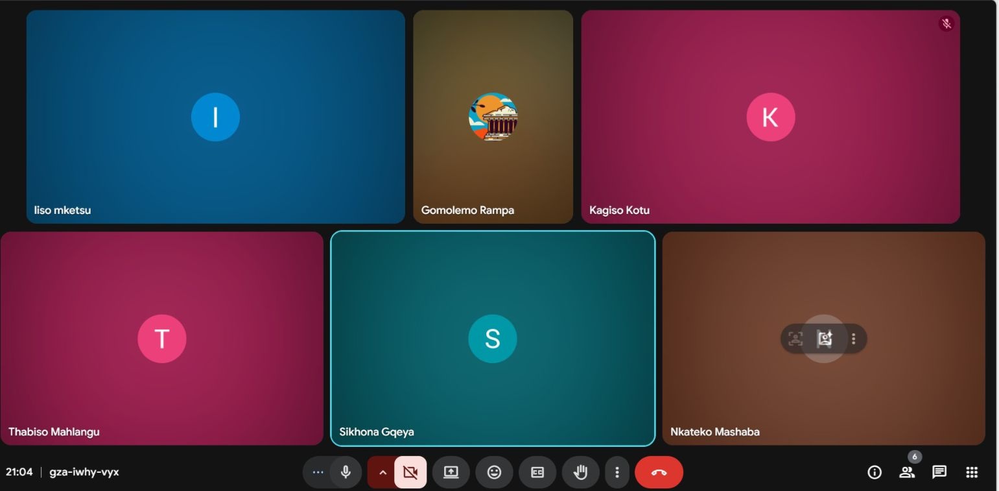

# Scrum 5

# Objectives

1. Present completed user stories to the team
2. Demonstrate functionality of each feature
3. Provide feedback and approve for sprint submission

---

## Meet up with Client

The team convened for the final Sprint 4 meeting where each member presented their completed user story to the group. The client was not present at this internal presentation, but the team prepared for client submission. All team members were present.

**Presentation Format:**

Each team member had 5-7 minutes to demonstrate their feature, followed by group feedback and questions.

---

## Choose Specifications

**Presentations & Feedback:**

| Team Member | User Story | Demonstration Summary | Team Feedback |
|-------------|------------|----------------------|---------------|
| Kagiso | Contribution compliance reports | Showed reports showing member payment consistency over time with visual charts | Approved – add tooltips for clarity |
| Nkateko | Payout history and projections | Displayed past payouts and future projections based on contribution trends | Approved – projections accurate |
| Gomolemo | Customizable analytics dashboard | Demonstrated filtering options and CSV/PDF export functionality | Approved – export formatting looks professional |
| Thabiso | Payout disbursement initiation | Showed how treasurer can initiate digital payouts with confirmation | Approved – add success/error notifications |
| Sikhona | Missed payment confirmation/flagging | Demonstrated flagging missed payments and tracking follow-ups | Approved – ready for client review |
| Liso | Direct bank account payouts | Showed bank account input, validation, and payout receipt | Approved – validation working correctly |

**Overall Sprint Assessment:**

| Metric | Status |
|--------|--------|
| All user stories completed |  Yes |
| Features integrated with existing system |  Yes |
| Testing completed |  Yes |
| Documentation prepared |  Yes |
| Ready for client submission |  Yes |

---

## Create Backlog

**Items completed in Sprint 4:**

-  Contribution compliance reports (Kagiso)
-  Payout history and projections (Nkateko)
-  Customizable analytics dashboard with CSV/PDF export (Gomolemo)
-  Payout disbursement initiation (Thabiso)
-  Missed payment confirmation/flagging (Sikhona)
-  Direct bank account payouts (Liso)

**Retrospective Notes (for next sprint):**

- Start integration testing earlier
- Document APIs before implementation begins
- Continue daily stand-ups for better coordination

## Evidence

